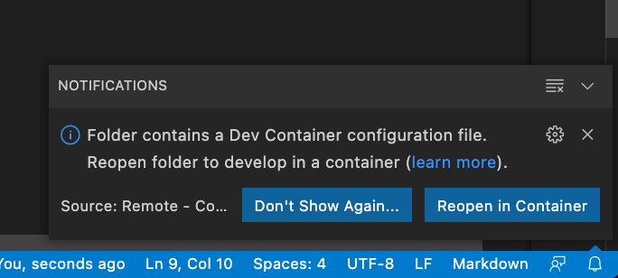

# ros2_d_devenv

Development environment for [ros2_d](https://github.com/nonanonno/ros2_d)

## For vscode user

### Getting started

1. Clone ros2_d or your forked project into the top of this project.
    1. Need to be named `ros2_d`
2. Open this project with vscode
3. vscode will ask you to `Reopen in Container` like this image, then click it
    1. Or you can find it in the command palette too

    
4. `ros2_d` will be opened in the container.

### Note

- `~/.ssh` is mounted
- `~/.gitconfig` is mounted
- User name in the container is `developer` but its UID is the same as yours

### ToDo

- Support no nvidia GPU user
